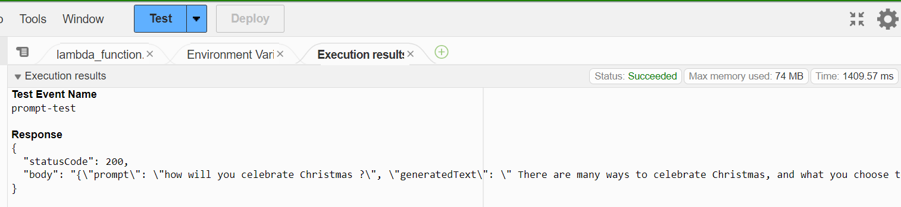
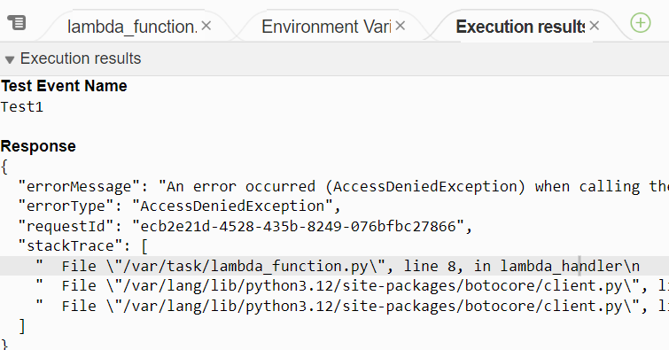
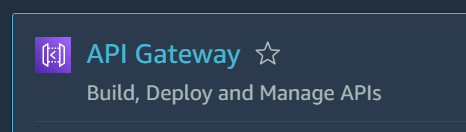
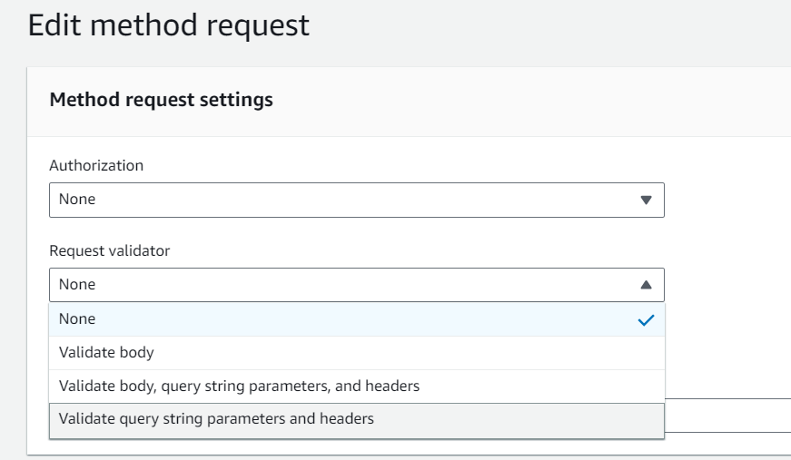
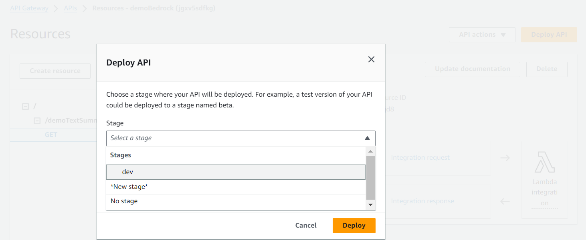

🖼️ Project Overview

# Project Description: 
User makes an API call via AWS API Gateway. The code resides in a Lambda Function triggering AWS Bedrock  [cohere AI foundational model](https://cohere.com/models/command)  
  Users get a response back, summarizing prompts.  

Limitation: 📏 Size of the input prompt for summarization.

Before You Begin

🟢 Enable foundational model in your AWS Account.  

🧩 Create a Lambda function.  

🔗 Refer to this helpful link for resolving runtime errors:
  https://repost.aws/knowledge-center/lambda-python-runtime-errors  

  🕵️‍♂️ Check the Boto3 version. It should be at least  > <code >1.28.63 </code > to use Bedrock.  

  if not you will need to create an extra layer and attach it to your lambda function   
   here the reference how to do so :  
 https://docs.aws.amazon.com/lambda/latest/dg/chapter-layers.html  

🛠️ Create a Boto3 client connection with Bedrock. Refer to the Bedrock Runtime documentation.  
 https://boto3.amazonaws.com/v1/documentation/api/latest/reference/services/bedrock.html 
📥 Create a Request Syntax. Fetch details from the console; the body should be a JSON object.  
📜 Convert Streaming Body to Byte and then Byte to String.  
Print the Event.  
Store the input in a Variable.  
Update the Response Body.  
Model ID and Testing  

modelId refers to the Language Model (LLM) used. Find more details about model parameters here.  
https://boto3.amazonaws.com/v1/documentation/api/latest/reference/services/bedrock-runtime/client/invoke_model.html

Testing the code:     

# Lambda Function code...
🛑 If you encounter Access Denied issues, create an IAM Role and attach it to the function.

Your response should confirm the correct Lambda invocation.
 
 

# Setting Up REST API using AWS Gateway

🌐 REST API Gateway:  
    
  

  Integration Request and Mapping Templates.  

  API Deployment.  
  

  

 🔍 Use meaningful log data or articles to test summarization effectiveness. For instance, consider testing with this resource. Observe and evaluate the summarization results.  

The code, written in Python, is included in this repository. You can freely modify it to suit your specific requirements. If you have any questions or need further assistance, don't hesitate to reach out to me via [LinkedIn](https://www.linkedin.com/in/nickjabs/)