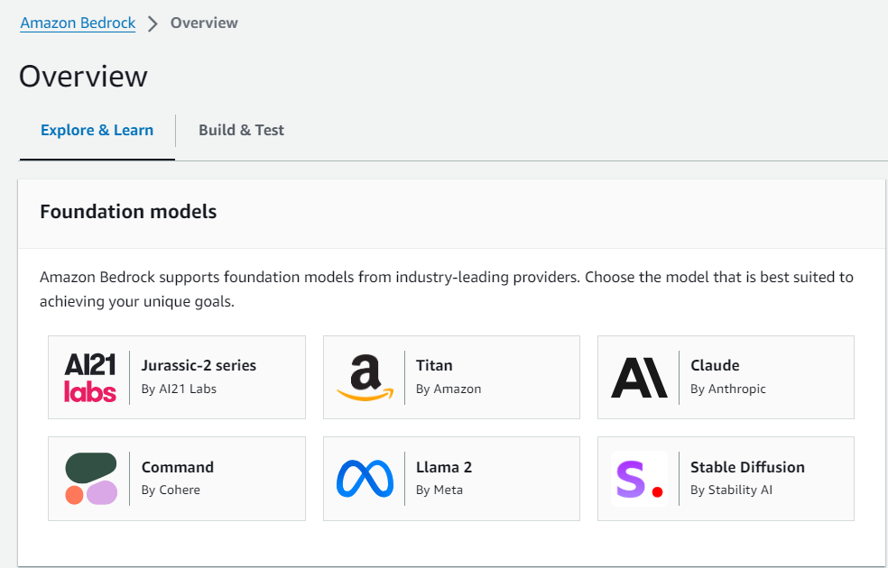
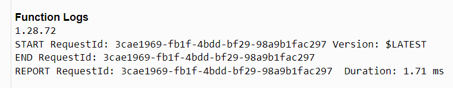
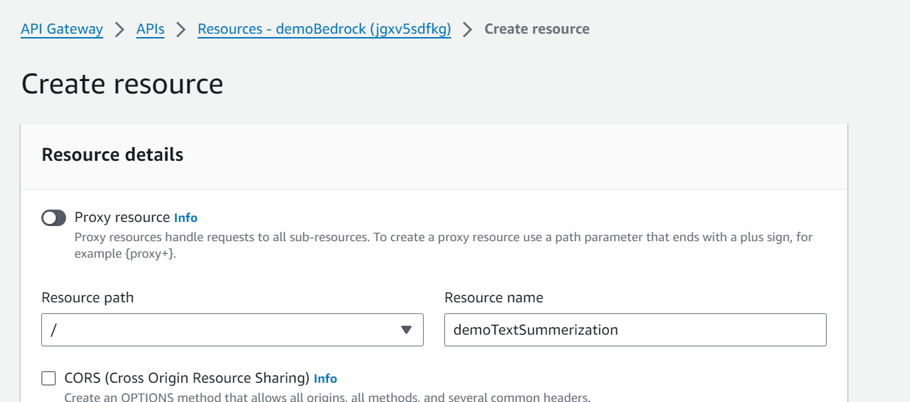
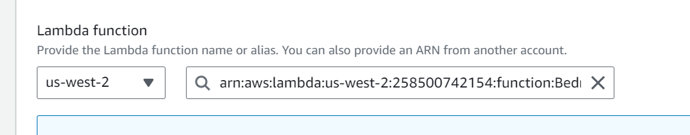
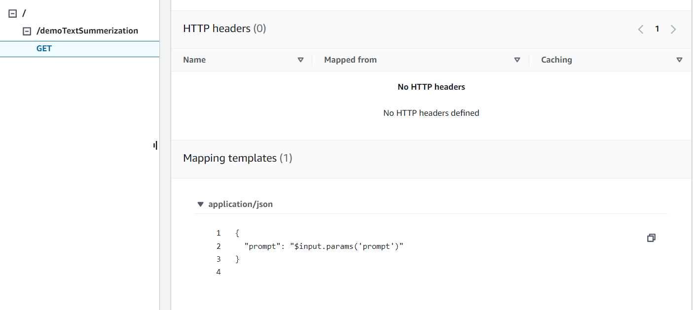
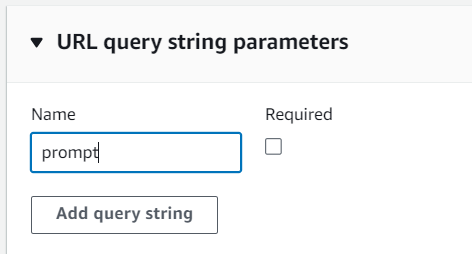
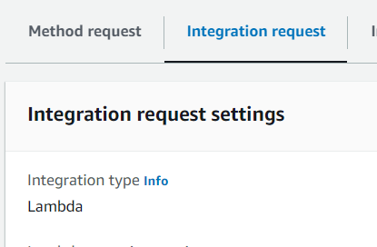
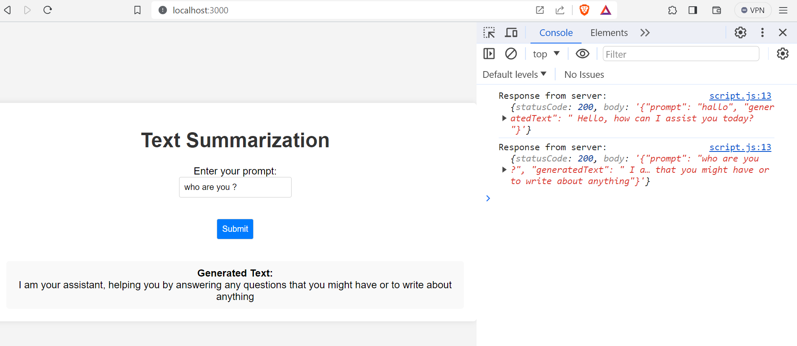

 🖼️ Project Overview  
  

 Project Description 
This project involves making an API call via AWS API Gateway, utilizing a Lambda Function connected to AWS Bedrock's foundational model from [Cohere AI](https://cohere.com/). Users receive responses summarizing prompts they provide.

Project Overview Diagram

Limitation
📏 Input prompt size for summarization is limited.

Before You Begin
🟢 Enable the foundational model in your AWS Account. Screenshot Guide

🧩 Create a Lambda function. For resolving runtime errors, reference [AWS Knowledge Center](https://repost.aws/knowledge-center/lambda-python-runtime-errors)

🕵️‍♂️ Ensure Boto3 version is at least <code>1.28.63</code> Boto3 Version Check Guide. Create an extra layer and attach it to your lambda function if the version is lower. [Layer Attachment Guide](https://docs.aws.amazon.com/lambda/latest/dg/chapter-layers.html) 

   

🛠️ Create a Boto3 client connection with Bedrock, as detailed in the [Bedrock Runtime](https://boto3.amazonaws.com/v1/documentation/api/latest/reference/services/bedrock-runtime.html) documentation here.

Lambda Function Code
Detailed steps include creating a Boto3 client connection, forming the request syntax, and handling the response. Example code for invoking the model and testing is provided.

🛑 If encountering Access Denied issues, create an IAM Role and attach it to the function. Access Denied Screenshot

Setting Up REST API using AWS Gateway
🌐 Setting up the REST API Gateway involves creating resources, integration requests, mapping templates, and API deployment. Configuration steps are provided with screenshots in the repository.  

 
 
 
 
 

 Testing

🔍 Use meaningful log data or articles to test summarization effectiveness. For instance, consider testing with provided resources or custom prompts.

Endpoint for API
The provided URL is an endpoint for an API that potentially performs text summarization based on the prompt query parameter. The query parameter is used to pass the text to be summarized. For example, the prompt "what day is it today" would trigger the API to generate a summary.

Code
The Python code for this project is included in this repository, ready for modification to suit specific requirements.

Result : 

For any inquiries or assistance, feel free to reach out via [LinkedIn.](https://www.linkedin.com/in/nickjabs/)